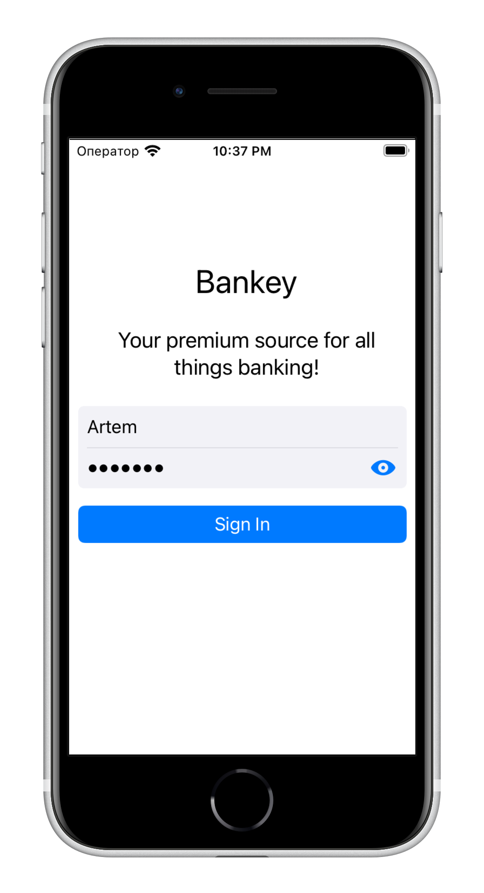
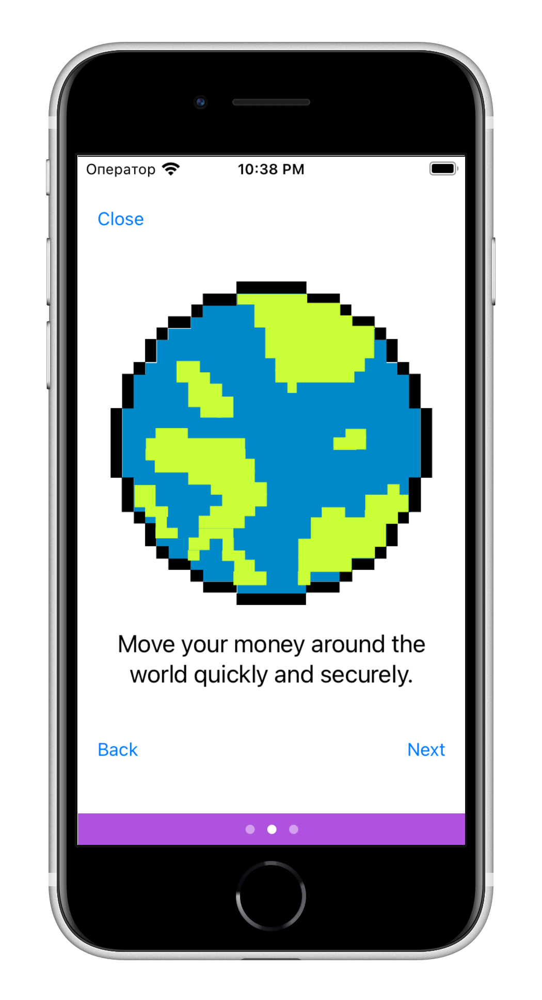
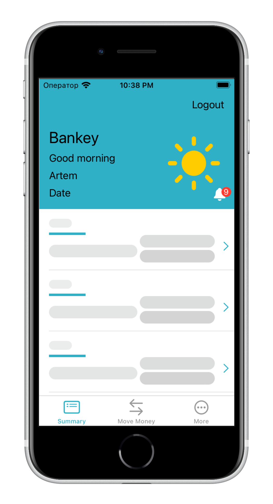
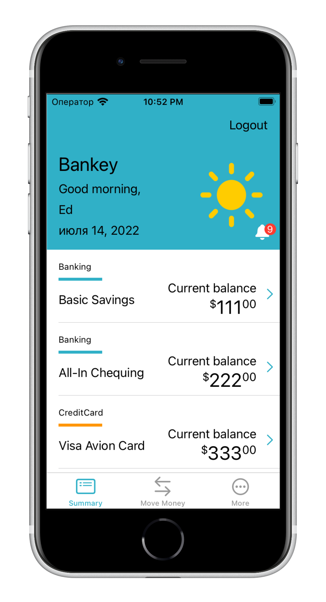

# Bankey

### The tutorial application was created without using storyboards.

Implemented such common functions as:
- log in
- onboarding
- unit testing 
- animation
- networking
and much more

<table>
    <tr>
    <td></td>
    <td></td>
</tr>
</table>

<table>
    <td></td>
    <td></td>
   </tr>
</table>
